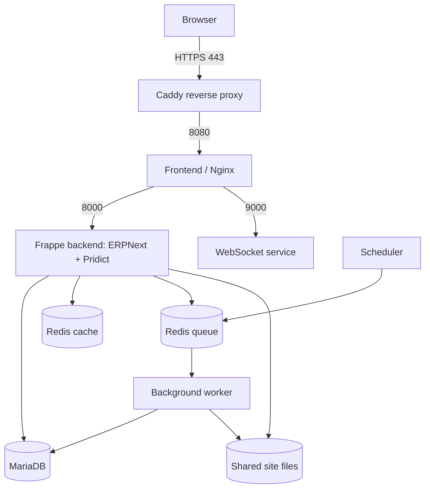

# Pridict technical guide

Version 1.0 — 17 September 2026. Audience: application maintainers, platform operators and technical support.

## Contents

1. Scope and evidence
2. Architecture and deployment topology
3. Source layout and extension model
4. Data model and business transactions
5. Authentication and authorization
6. Environment and configuration
7. Operations and diagnosis
8. Build, release and rollback
9. Backup and disaster recovery
10. Integrations and APIs
11. Quality assurance and production readiness
12. Maintenance and handover

## 1. Scope and evidence

This guide consolidates local source and project records. It does not represent a new live audit. The [implementation checkpoint](../../deployment/PRIDICT-IMPLEMENTATION-STATUS.md) records a read-only UAT version check on 17 September 2026; the [release handoff](../../deployment/PRIDICT-HANDOFF.md) records the rc3 release and hostname change on 16 September.

| Component | Recorded version/state |
|---|---|
| Frappe | 15.120.1 |
| ERPNext | 15.121.2 |
| Pridict custom app | 0.1.0 |
| UAT image | `pridict-erpnext:0.1.0-20260916-rc3` |
| Base image | `frappe/erpnext:v15.121.2` |
| Operating system | Ubuntu 24.04 on Azure VM |
| Database | MariaDB 10.6 in deployment Compose |
| Redis | 6.2 Alpine images |
| Reverse proxy | Caddy 2 Alpine image |

Versions above are a dated baseline, not an instruction to upgrade or proof of the state after later CLI work. Tags for supporting services are not all digest-pinned. Record exact digests when producing a reproducible release.

The latest checkpoint describes broad existing Pridict styling but incomplete rebranding, an executive dashboard not yet implemented, and incomplete full-screen/role/theme testing. Do not describe those planned capabilities as released. See the [coverage matrix](../../deployment/PRIDICT-UI-COVERAGE.md).

## 2. Architecture and deployment topology

Frappe provides documents, forms, persistence, authentication, permissions, background jobs and APIs. ERPNext supplies buying, selling, inventory, accounting and other business applications. Pridict currently adds its branding and UI assets as a separate app, preserving the underlying business workflows.



The actual service definition is [compose.yaml](../../deployment/compose.yaml). It is the authority if this diagram differs.

| Service | Responsibility | Operational check |
|---|---|---|
| proxy | Public TLS and HTTP routing | HTTPS, certificates, proxy logs |
| frontend | Static assets and upstream routing | Asset responses, upstream errors |
| backend | Requests, document logic and APIs | Login, form load, error logs |
| websocket | Real-time events | Connection failures and service logs |
| worker | `long,default,short` background queues | Queue health, failed jobs |
| scheduler | Scheduled task enqueueing | Enabled scheduler and timely execution |
| db | Persistent relational records | Health, storage, backup/restore |
| redis-cache | Cache | Availability and memory pressure |
| redis-queue | Jobs and related queue state | Availability, backlog, persistence |
| configurator | One-shot shared connection configuration | Successful exit rather than permanent running state |

### Azure baseline

- Resource group: `rg-erpnext`; VM: `erpnext-demo-vm`; region: Central India.
- VM size: `Standard_B2als_v2`, 2 vCPU / 4 GiB RAM; recorded disk: 32 GiB Standard SSD.
- Server deployment directory: `/opt/erpnext`.
- Public endpoint: `https://pridict-demo.centralindia.cloudapp.azure.com`.
- Recorded public IP resource: `erpnext-demo-ip`; IP address `20.198.2.1`.
- Recorded daily start: 07:00 IST; shutdown: 23:00 IST.
- Public inbound access is HTTP/HTTPS. Recorded administration method is Azure Run Command.

This is a single-VM UAT deployment. It has a single failure domain and scheduled downtime. It is not evidence of high availability, capacity for a paying customer workload, or a completed production readiness review.

## 3. Source layout and extension model

| Path | Purpose |
|---|---|
| `erpnext/` | ERPNext application source and DocTypes |
| `pridict_app/pridict/hooks.py` | Custom app metadata, assets and lifecycle hooks |
| `pridict_app/pridict/setup/install.py` | Branding configuration applied on install/migrate |
| `pridict_app/pridict/public/` | Pridict JavaScript, SCSS and image assets |
| `deployment/Dockerfile.pridict` | Versioned application image build |
| `deployment/build-pridict-image.sh` | Image build entry point |
| `deployment/release-pridict.sh` | Guarded UAT release procedure |
| `deployment/verify.sh` | Existing deployment smoke verification |
| `deployment/ROLLBACK.md` | Recovery paths and restrictions |
| `.github/workflows/pridict-image-check.yml` | Prepared image validation workflow |
| `design/` | Design references and preview; not deployed behavior |
| `documentation/pridict/` | These technical and user guides |

The custom app declares ERPNext as a required app. Its hooks include `pridict.bundle.css` and `pridict.bundle.js` for Desk/web, branding image URLs, and `apply_branding` after install and migration. Branding settings should be applied idempotently: a repeated migration must not duplicate records or damage user-owned configuration.

Keep ordinary branding, supported overrides and new UI components in the custom app. Internal app names, Python imports, DocType identifiers and existing workspace routes are integration contracts, not merely visible labels. A global string replacement of `frappe` or `erpnext` risks breaking code and stored links. Preserve required third-party notices and accurately identify external authentication providers.

For shared UI changes, use reusable tokens/components and verify every distinct screen type. A shared stylesheet does not prove coverage of child grids, specialized reports, portals, emails or PDF output. Business calculations and permissions must remain server-enforced.

## 4. Data model and business transactions

A Frappe DocType defines fields and behavior for a document. Transactions usually have a parent document plus child rows such as items, taxes or payment references. Linked names and child-row references connect the business chain.

Standard submittable document lifecycle uses `docstatus`: 0 draft, 1 submitted, 2 cancelled. A separate business `status` and optional workflow state describe progress/approval. Do not infer financial posting from a display badge alone.

### Procurement linkage verified in source

The Material Request mapping in [material_request.py](../../erpnext/stock/doctype/material_request/material_request.py) validates a submitted Purchase request. It maps source parent and item-row identifiers into Purchase Order item references and filters eligible remaining quantities. The [client code](../../erpnext/stock/doctype/material_request/material_request.js) exposes the Create action according to state and supports an optional default-supplier filter.

Preserving these links lets later receipts/invoices update ordered, received and billed progress. Recreating independent documents with identical text is not equivalent to mapped transactions.

### Effects to preserve during customization

| Event | Stock movement | Typical accounting effect |
|---|---|---|
| Material Request / Purchase Order | None | No ordinary purchase GL posting |
| Purchase Receipt for stock goods | Increase accepted/relevant warehouse quantities | Inventory/interim liability under perpetual inventory |
| Purchase Invoice against receipt | No duplicate receipt | Supplier payable and clearing/expense/tax effects |
| Supplier Payment Entry | None | Payable allocation and bank/cash movement |
| Sales Order | No physical dispatch | No ordinary sales GL posting |
| Delivery Note | Decrease dispatched stock | Inventory/cost effect under perpetual inventory |
| Sales Invoice against delivery | No duplicate dispatch | Revenue, receivable and tax effects |
| Customer Payment Entry | None | Receivable allocation and bank/cash movement |

Direct invoices with Update Stock, returns, valuation adjustments and configuration alter the exact path. Keep standard document-controller validations. Never fix ledger discrepancies with direct SQL updates or by disabling validation.

## 5. Authentication and authorization

Frappe authenticates users and applies role, document and user permissions. Desk users and website/portal users have different access scopes. Use named accounts and least necessary rights; test as ordinary users as well as Administrator.

The 17 September checkpoint records no Social Login Key records and LDAP disabled in the inspected UAT settings. It does not establish that every possible integration is disabled or that the reported authentication label has been identified. Changing a visible provider label must not redirect an authentication endpoint or impersonate another provider.

For new dashboard/server endpoints:

1. Require appropriate authentication.
2. Check document/report permissions and company/user restrictions server-side.
3. Avoid unrestricted database aggregations that leak cross-company totals.
4. Define metric dates, currencies, cancellation treatment and accounting meaning.
5. Return honest empty/error states instead of sample business figures.
6. Test direct API access as restricted users, not just hidden menu buttons.

Company filtering is not equivalent to independent SaaS tenancy. A customer-specific deployment/site requires deliberate database, file, user, backup and routing isolation. A separate Company in a shared site must not be sold as proven tenant isolation without a tested permission design.

## 6. Environment and configuration

### Public hostname versus internal site

| Setting | Recorded value/purpose |
|---|---|
| `PUBLIC_HOSTNAME` | `pridict-demo.centralindia.cloudapp.azure.com`, public HTTPS identity |
| `SITE_NAME` | `riditstack-erpnext-demo.centralindia.cloudapp.azure.com`, preserved internal Frappe site identifier |
| Site `host_name` | Public HTTPS URL used for generated links |
| `FRAPPE_SITE_NAME_HEADER` | Nginx routing to the internal site |
| `ERPNEXT_IMAGE` | Versioned application image selected by Compose |

A public DNS rename does not require renaming the internal site/database. Caddy, DNS, generated-link settings and routing must agree. Recheck login, absolute links, assets, TLS and configured integration callbacks after any future hostname change.

### Secrets and volumes

Server `.env` is root-readable and includes deployment credentials. Local private material belongs in the ignored `.deployment-private/` location. Do not include secrets, full environment dumps, API keys, site database passwords or encryption keys in tickets or published documentation.

| Volume | Data |
|---|---|
| `sites` | Site configuration, public/private files and shared site content |
| `db-data` | MariaDB persistent data |
| `logs` | Application logs |
| `redis-data` | Queue persistence |
| `caddy-data`, `caddy-config` | Proxy state, including certificate-related data |

Container replacement should preserve named volumes. `docker compose down -v` deletes them and is not a routine redeployment command. An image archive does not contain a backup of the live database and uploaded files.

## 7. Operations and diagnosis

### Local operator checks: PowerShell

From the repository root, with Azure CLI authenticated to the intended subscription:

```powershell
.\deployment\manage-vm.ps1 -Action status
```

The same script accepts `start` and `stop`; stop deallocates the VM. These are operational actions, not prerequisites for reading documentation. Review the automatic startup schedule if the VM must stay stopped. Persistent infrastructure such as disks can still incur charges while compute is deallocated.

### Server inspection: Bash through authorized Azure Run Command

```bash
cd /opt/erpnext
docker compose ps
docker compose logs --tail 80 backend frontend worker scheduler proxy
df -h
docker system df
```

Review logs privately and redact sensitive record/customer data before sharing. A completed configurator container is expected; long-running application services should be up and the database healthy. Do not run destructive pruning based only on disk usage output.

To inspect application state, first obtain the current non-secret internal site name. For the recorded deployment:

```bash
cd /opt/erpnext
site_name='riditstack-erpnext-demo.centralindia.cloudapp.azure.com'
docker compose exec -T backend bench --site "$site_name" list-apps
docker compose exec -T backend bench doctor
```

These commands inspect state; they do not install or migrate apps. Check the current site name if the deployment changes.

### Symptom guide

| Symptom | Investigate in order |
|---|---|
| Connection timeout | VM power state/schedule, public address, network rules, proxy |
| 502/upstream error | Backend/frontend startup, database health, service logs |
| Wrong/unavailable site | Hostname, Caddy route, site header, internal site configuration |
| Missing styles or old logo | Image identity, built asset manifest, asset response, browser cache |
| Login succeeds but access denied | User roles, permissions, company restrictions, document owner |
| Email/jobs do not complete | Scheduler, worker, Redis, queue errors and email configuration |
| Stock/report mismatch | Source vouchers, company/date filters, posting status, valuation/reposting |
| Migration failure | Release log, exact candidate image, installed apps, disk capacity |

Preserve evidence before restarting or changing settings. Application health, successful login and correct financial results are separate checks. Never run a migration as a speculative first response to a UI issue.

## 8. Build, release and rollback

### Development baseline

The repository has a Docker/bench development setup. The checkpoint found Docker Desktop installed but its Linux engine stopped; host Python/Node versions do not establish compatibility with the pinned application image. Use the prescribed containerized build, and resolve environment blockers before claiming fresh build/browser tests passed.

Preserve concurrent CLI changes. Capture the current branch, working-tree diff and exact source state before a release. Existing local untracked files are part of this project's work, not disposable files.

### Candidate preparation

1. Review the implementation/status/coverage records and diff.
2. Build a new unique image tag with `deployment/build-pridict-image.sh`; do not reuse a released tag.
3. Record source commit or immutable source archive hash plus image ID/digest.
4. Run build/asset, install/migration, UI, permissions and business acceptance checks.
5. Review database/schema changes, operational downtime and recovery compatibility.
6. Preserve the previous working image and create/verify fresh off-VM backups.
7. Distribute the candidate by the approved image transfer/registry process. Do not assume a registry exists merely because an image tag exists.

### Guarded cutover

Read the actual [release script](../../deployment/release-pridict.sh) before use. It requires `PRIDICT_RELEASE_APPROVED=YES`, a `PREDEPLOY_BACKUP_BLOB`, and `PREDEPLOY_SNAPSHOT`. These are operator safeguards; nonempty identifiers alone do not prove that the referenced backups are recoverable.

The script records release state, enables maintenance, disables scheduled work, stops worker/scheduler services, changes the candidate image and performs its installation/migration/restart/verification sequence. Review the full current script rather than relying solely on this description. A failure can leave maintenance enabled so traffic does not continue against an uncertain state.

Post-release evidence should include exact versions, HTTPS/login, authenticated assets, normal-role access, worker/scheduler state, maintenance off, UI results and relevant transaction/report reconciliation. Record exceptions explicitly.

### CI/CD status

The handoff records a prepared image-check workflow but no Git push/publication of that workflow at release time. The obsolete Azure Container Apps deployment was disabled. A repository push must not be assumed to deploy the VM. Verify the actual remote workflow runs and VM deployment path before advertising automated CI/CD.

### Rollback

Follow [ROLLBACK.md](../../deployment/ROLLBACK.md). After installing Pridict into the site database, reverting to an image without the app can break the site. Recovery may require a compatible fix-forward image or a matched database/files/configuration restore. A rollback to an older data snapshot loses changes after that point; preserve current evidence/data and obtain an operational decision before restoration.

Do not delete the current disk or volumes as a shortcut. Retain the previous image until the release acceptance and recovery retention policy allow cleanup.

## 9. Backup and disaster recovery

### Recorded recovery assets

The release handoff records private Azure Blob Storage account `pridictbkp260916`, container `erpnext-backups`. For rc3:

- Backup blob: `predeploy/2026/09/16/pridict-precutover-20260916-rc3.tar.gz`.
- Source archive: `release-candidates/2026/09/16/pridict-rc3-source.tar.gz`.
- Server release state: `/opt/erpnext/release-state/20260916T160013Z.env`.
- Release logs: `/opt/erpnext/release-sources/20260916-rc3/`.

The handoff records upload/download hash verification and an earlier restore drill. This documentation task has not rechecked blob availability, retention or restore success. Recorded point-in-time backups do not establish a recurring backup schedule.

### Required recovery set

Retain the database backup, public and private uploaded files, site configuration including necessary encryption material, exact app source/image versions, deployment configuration and restore instructions. Protect this set as sensitive; restoring only the database may leave files or encrypted integration credentials unusable.

### Recovery drill procedure

1. Choose an isolated target and record the required recovery point.
2. Validate backup checksums, completeness and access to the compatible application image.
3. Restore using the version-appropriate Frappe procedure under an operator's reviewed runbook.
4. Keep outbound email, scheduled integrations and customer traffic isolated during the drill.
5. Validate login, installed apps, document counts, attachments, stock/financial reports and permissions.
6. Measure recovery time and data-loss window; record failures and corrective actions.
7. Only route traffic after explicit operational acceptance; retain the previous environment until safe cleanup.

Before production, agree recovery point objective (maximum acceptable lost data), recovery time objective (maximum outage), backup frequency, retention and alert ownership. Do not invent these business requirements from the current UAT schedule.

## 10. Integrations and APIs

Frappe provides document APIs and whitelisted application methods. Integrations should use a dedicated least-privileged identity, HTTPS and a secrets store. They must preserve document validation and permissions rather than writing directly into tables.

For each integration record the external system, owner, authentication method, allowed actions, company scope, data mapping, retry policy and monitoring. Design idempotency so retrying a request cannot create duplicate orders or payments. Log correlation IDs and errors without logging credentials or unnecessary personal data.

Verify the deployed Frappe version's API behavior before implementing a client. This guide does not provision API keys, configure email, enable bank payment initiation, or assume that marketplace integrations are installed.

External messages require configured accounts/providers and intentional sending behavior. Rendering an invoice or recording a Payment Entry is not equivalent to emailing the customer or initiating a bank transaction.

## 11. Quality assurance and production readiness

Use [PRACTICE-WORKBOOK.md](PRACTICE-WORKBOOK.md) as one end-to-end trading acceptance case. Extend it for real taxes, returns, foreign currency, batches/serials, approvals and partial fulfillment according to customer scope.

For every release record:

- Build and image identity; installation and repeat-migration outcome.
- Login/recovery and role/company access tests.
- Lists, forms, child tables, reports, dialogs, errors and empty states.
- Light/dark, desktop/narrow screen, keyboard and readable focus/contrast.
- MR→PO linkage, receipt/invoice separation, sales dispatch/invoice separation, payment allocation and ledger reconciliation.
- Public/private attachments, print/PDF and enabled communications/portal surfaces.
- Backup/restore readiness and service health after restart.

A broad stylesheet and a passing HTTP 200 check cannot substitute for these outcomes. Maintain evidence per screen class and module in the coverage matrix. Do not claim a complete regression suite when tests are blocked by fixtures/dependencies.

Before onboarding paying customers, address availability hours, resource capacity, tenant isolation, backup automation and restore objectives, monitored alerts, upgrade policy, access/offboarding, support ownership and applicable licensing/compliance obligations. The current single-VM demo establishes none of those guarantees by itself.

## 12. Maintenance and handover

Keep the deployment README, release handoff, implementation status, branding inventory, UI coverage matrix and these guides consistent. Historical records should remain historical; add a clearly dated current record instead of silently treating an old verification as current.

For incidents capture time, URL/document ID, role/company, exact error, release identity and relevant redacted logs. Identify whether the failure is visual, permission-related, business validation, infrastructure or integration before modifying code.

For upgrades create a candidate against a restored test copy, review migrations, validate custom app compatibility and rerun representative stock/accounting flows. Preserve user-owned configuration and required notices. Deployment and recovery scripts are operational code and deserve review with the application change.

### Local authorities

- [Deployment README](../../deployment/README.md)
- [Compose topology](../../deployment/compose.yaml)
- [Release handoff](../../deployment/PRIDICT-HANDOFF.md)
- [Implementation checkpoint](../../deployment/PRIDICT-IMPLEMENTATION-STATUS.md)
- [UI coverage matrix](../../deployment/PRIDICT-UI-COVERAGE.md)
- [White-label plan](../../deployment/PRIDICT-WHITE-LABEL-PLAN.md)
- [Custom app hooks](../../pridict_app/pridict/hooks.py)
- [Rollback runbook](../../deployment/ROLLBACK.md)

Where records disagree, verify the current source and runtime and update the baseline. In particular, older deployment README language about the stock image is superseded by the later versioned Pridict release record; no deployment documents were modified by this documentation task.
